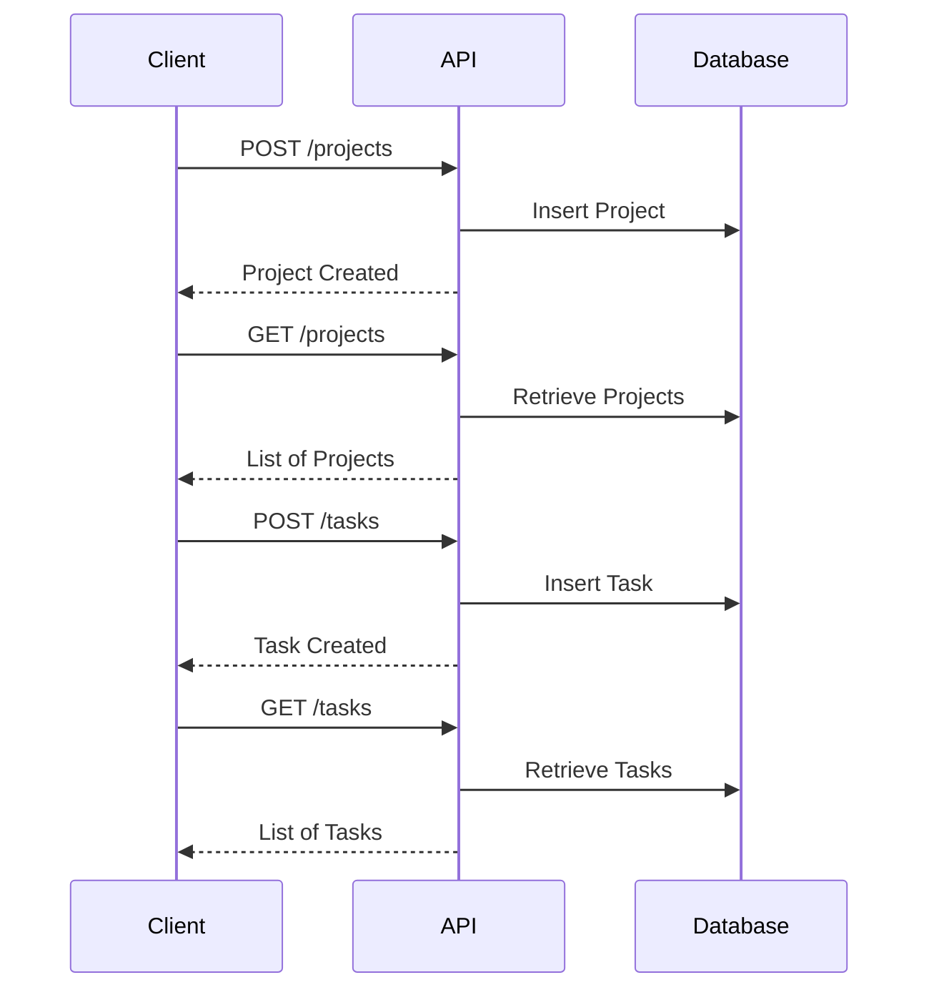

# Go and MySQL REST API for Project Management

This project provides a RESTful API for managing projects, users, and tasks. It's inspired by Jira and allows you to create, update, and retrieve project-related data.

## Setup

1. **Database Configuration:**
   - Create a MySQL database (e.g., `project_management`).
   - Configure the database access credentials in a `.env` file. Use the `.env.example` file as a template.
   - Define the following environment variables:
     - `DB_USER`: MySQL username (e.g., `root`)
     - `DB_PASSWORD`: MySQL password (if applicable)
     - `DB_HOST`: MySQL host (e.g., `localhost`)
     - `DB_PORT`: MySQL port (default is `3306`)
     - `DB_NAME`: Database name (e.g., `project_management`)

2. **Build Package:**
   ```bash
   make build
   ```

3. **Run the Application:**
   ```bash
   make run
   ```

## API Endpoints

### Projects

- **Create a Project:**
  - **URL:** `POST /projects`
  - **Request Body:**
    ```json
    {
      "name": "My Project",
      "description": "A sample project"
    }
    ```
  - **Response:**
    ```json
    {
      "id": 1,
      "name": "My Project",
      "description": "A sample project"
    }
    ```

- **Get All Projects:**
  - **URL:** `GET /projects`
  - **Response:**
    ```json
    [
      {
        "id": 1,
        "name": "My Project",
        "description": "A sample project"
      }
    ]
    ```

### Users

- **Create a User:**
  - **URL:** `POST /users`
  - **Request Body:**
    ```json
    {
      "username": "john_doe",
      "email": "john@example.com"
    }
    ```
  - **Response:**
    ```json
    {
      "id": 1,
      "username": "john_doe",
      "email": "john@example.com"
    }
    ```

- **Get All Users:**
  - **URL:** `GET /users`
  - **Response:**
    ```json
    [
      {
        "id": 1,
        "username": "john_doe",
        "email": "john@example.com"
      }
    ]
    ```

### Tasks

- **Create a Task:**
  - **URL:** `POST /tasks`
  - **Request Body:**
    ```json
    {
      "projectId": 1,
      "title": "Implement feature X",
      "assigneeId": 1
    }
    ```
  - **Response:**
    ```json
    {
      "id": 1,
      "projectId": 1,
      "title": "Implement feature X",
      "assigneeId": 1
    }
    ```

- **Get All Tasks for a Project:**
  - **URL:** `GET /tasks?projectId=1`
  - **Response:**
    ```json
    [
      {
        "id": 1,
        "projectId": 1,
        "title": "Implement feature X",
        "assigneeId": 1
      }
    ]
    ```

## Mermaid Diagram

